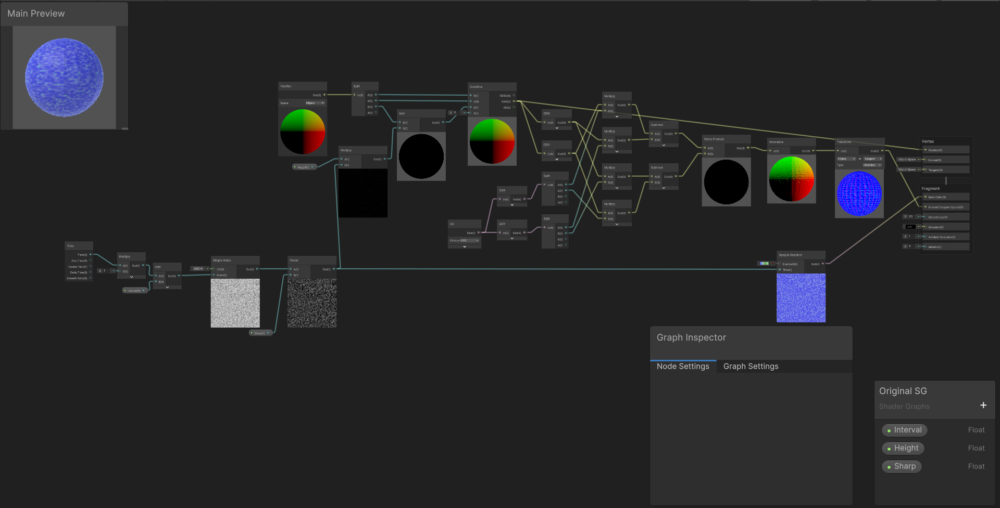

# 頂点の移動
頂点を動かし、適切にライティングを行います。

src フォルダをUnityで開きます。

https://github.com/simulacru/test/assets/104343269/50cc8217-bc7f-438b-97d3-adf9aef8528d

## 自分なりに変更した点
- Sample Gradientの色を変えて頂点が低いと海、高いと陸のように見えるようにした
- アニメーションをつけ、回転するようにした

## 進め方

- 本リポジトリをフォークしてください
- フォークしたリポジトリをcloneします
- Unityのプロジェクトを更新して実装してください。
  - 結果画像1（1番上の画像）と同じシーンを「1 Height Scene」に実現してください
  - 結果画像2（2番目の画像）と同じシーンを「2 Color Scene」に実現してください
  - 結果画像3（3番目の画像）と同じシーンを「3 Normal Scene」に実現してください
  - 自分なりにかっこいいシーンを「4 My Best Scene」に作成してください
- 「4 My Best Scene」の結果をUnity RecorderでMovieとして保存し、result.gifと差し替えてください（サイズが大きくて上げられない場合は、解像度を小さくするなどして下さい）
- node_graph.pngを自分のシェーダグラフの一番頑張ったノードと差し替えてください
- このテキストファイルに変更点を記載してください
- プルリクエストを出して提出してください
